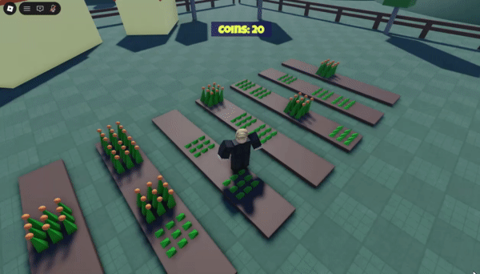

# Roblox Crop Harvesting Simulator

Grow crops, collect the ready ones, and earn coins.

## Gameplay

## How to Play

Explore the field and wait for crops to grow. Click a fully grown crop to harvest it and earn 10 coins.

## Crop Growth

`GrowthManager` checks each unfinished tile when `run(deltaTime)` is called. It uses the elapsed time to scale the chance of a crop growing, so growth stays roughly consistent across different update rates. With a 5% chance per second, the chance at 60 updates per second is about 0.083% per update.

When a crop advances, `Tile` replaces its model with the prefab for the new stage. Harvesting a fully grown crop resets it to the starting stage and awards coins. The coin display updates when the player's coin total changes.

The growth manager needs to be called by an update loop that provides `deltaTime`; that caller isn't included in the current scripts.